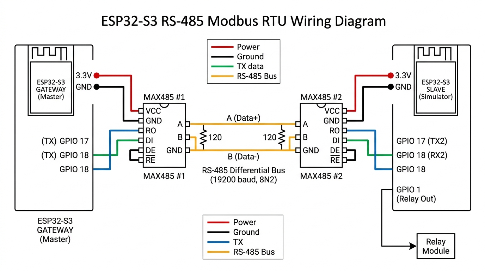

# EcoWell IoT Gateway & Modbus RTU Slave Simulator

An end-to-end industrial IoT solution designed for the EcoWell Water Softener system. This project features a dual-core ESP32-S3 **IoT Gateway** that polls telemetry over RS-485 Modbus RTU, evaluates a local state machine with safety interlocks, and securely bridges data to a self-hosted cloud HMI/SCADA dashboard over Wi-Fi. It also includes an ESP32-S3 **Modbus RTU Slave Simulator** with an interactive CLI for testing.

---

## 🌐 Live Cloud SCADA Dashboard (For Recruiters)

The SCADA dashboard is hosted on a public Linux AWS instance and is actively connected to our secure cloud MQTT broker. 

* **HMI / SCADA Dashboard URL**: `http://13.233.38.147:12000`
  * *Username*: `ecowell`
  * *Password*: `pass@123`
* **MQTT Broker URL**: `mqtt://13.233.38.147:1883`

---

## 🛠️ System Architecture Overview

```text
                ┌────────────────────────────────────────────────────────┐
                │                  CLOUD / MQTT BROKER                   │
                └───────────────▲───────────────────────┬────────────────┘
                                │                       │
                      Telemetry │ & Alerts              │ Inbound commands
                                │                       ▼
                ┌───────────────┴───────────────────────┴────────────────┐
                │                      MQTT SERVICE                      │
                └────────▲──────────────────▲────────────────────┬───────┘
                         │                  │                    │
               Telemetry │                  │ Alerts             │ Forward msg
                         │                  │                    ▼
                ┌────────┴──────┐  ┌────────┴──────┐    ┌────────────────┐
                │   PUBLISHER   │  │ ALERT SERVICE │    │   SUBSCRIBER   │
                └────────▲──────┘  └────────▲──────┘    └────────┬────┬──┘
                         │                  │                    │    │
                         │ Reads            │ Gets               │    │ Other writes
                         │ tags             │ events             │    └─────────┐
                         │                  │                    ▼              │
                ┌────────┴──────┐  ┌────────┴──────┐    ┌────────────────┐      │
                │  TAG RUNTIME  │  │ EVENT SERVICE │◄───┤      CORE      │      │
                │ (Live Cache)  │  │  (Event Bus)  │    │ (Softener FSM) │      │
                └────────▲──────┘  └────────────────┘    └────────┬───────┘      │
                         │                                        │             │
          Updates values │                         Modbus command │             │
                         │                                        ▼             ▼
 ┌──────────────┐        │                              ┌─────────────────────────────┐
 │ ACQUISITION  ├────────┘                              │     PROTOCOL DISPATCHER     │
 │    ENGINE    │◄──────────┐                           └─┬─────────────┬───────────┬─┘
 └──────▲───────┘        │                              │             │           │
        │                │                         Modbus │      System │       CAN │ (routes by source)
        │                │                                ▼             ▼           ▼
        │ (Posts         │                              ┌───────────┐ ┌───────────┐ ┌───────────┐
        │  Responses)    │                              │  MODBUS   │ │  SYSTEM   │ │    CAN    │
        ├────────────────┼──────────────────────────────┤  SERVICE  │ │  SERVICE  │ │  SERVICE  │
        │                │                              └─────┬─────┘ └─────┬─────┘ └─────┬─────┘
        │                │                                    │             │             │
        └────────────────┴────────────────────────────────────┴─────────────┴─────────────┘
                                                       (All post responses back to Acq)
```

### 1. Cloud Interface
* **Wi-Fi Service**: Event-driven station connection manager with automatic reconnection on drops.
* **MQTT Service**: Low-overhead thread-safe publisher/subscriber interface equipped with a Last Will & Testament (`offline` status) and credentials.
* **Publisher / Subscriber Tasks**:
  * **Publisher**: Queries the live cache every 20 seconds and posts structured JSON telemetry via ArduinoJson.
  * **Subscriber**: Listens to write coil commands (regeneration trigger) and dispatches them securely to the state machine or local bus.
* **Event & Alert Service**: Decorates system state transitions (faults, warnings, regenerations) into human-readable alerts published to the cloud.

### 2. Local Control Loop
* **Acquisition Engine**: Periodically polls tags at 10-second intervals.
* **Protocol Dispatcher**: An abstraction router separating acquisition logic from driver layers (Modbus/System/CAN).
* **Modbus Service**: Master driver managing asynchronous UART communication over Serial1 at 19200 baud.
* **Tag Runtime**: A thread-safe, in-memory cache protected by a FreeRTOS Mutex to prevent race conditions.
* **Core Task (Softener FSM)**: A state evaluator executing on Core 1 every 2 seconds. Protects operations with safety interlocks (checks data validity and active faults before acting) and triggers automatic cycle-stops on timeouts.

---

## 📂 Repository File Structure

```text
EcoWell_Assignment/
├── EcoWell_MQTT-MODBUS_GATEWAY/     # Gateway Project Folder
│   ├── platformio.ini               # PlatformIO Environment Config
│   ├── Documentation.docx   # Comprehensive Gateway Design Document
│   ├── include/                     # Public Header Interfaces (.h)
│   └── src/                         # Core Implementation Files (.cpp)
│       ├── main.cpp                 # Boot orchestrator & Event mediator
│       ├── core.cpp                 # Softener State Machine & command evaluators
│       ├── wifi_service.cpp         # Connection lifecycle state machine
│       ├── modbus_service.cpp       # RS-485 master driver
│       └── tag_runtime.cpp          # Mutex-locked runtime database
│
└── EcoWell_MODBUS_RTU_SLAVE/        # Modbus RTU Slave Simulator Folder
    ├── platformio.ini               # PlatformIO Environment Config
    ├── Documentation.docx      # Detailed Slave Design Document
    └── src/
        └── main.cpp                 # Register mapping & USB Serial CLI
```

---

## 💻 Local Setup & Installation

### 1. Prerequisites
To inspect, modify, or build the firmware projects, install:
* **Visual Studio Code** (VS Code)
* **PlatformIO IDE Extension** (Search and install from the VS Code Extensions market)
* **CP210x USB to UART Bridge Drivers** (If your ESP32-S3 board requires driver access)

### 2. Cloning the Repository
Clone the codebase to your local drive using a git terminal:
```bash
git clone https://github.com/your-username/your-repo-name.git
cd your-repo-name
```

### 3. Open in VS Code
1. Open Visual Studio Code.
2. Click **File -> Open Folder...**
3. Select either `EcoWell_MQTT-MODBUS_GATEWAY` or `EcoWell_MODBUS_RTU_SLAVE`. PlatformIO will automatically read the `platformio.ini` file and install the necessary compiler frameworks and library dependencies (eModbus, PsychicMqttClient, ArduinoJson).

---

## 🔌 Hardware Setup & Pinout Mappings

Connect the two ESP32-S3 boards using RS-485 transceiver modules (e.g., MAX485 or similar):

| ESP32-S3 Gateway Pin | Connection | ESP32-S3 Slave Pin | Notes |
| :--- | :--- | :--- | :--- |
| **GPIO 17 (TX)** | $\rightarrow$ | **GPIO 18 (RX)** | UART Cross connection (TX $\rightarrow$ RX) |
| **GPIO 18 (RX)** | $\rightarrow$ | **GPIO 17 (TX)** | UART Cross connection (RX $\rightarrow$ TX) |
| **GND** | $\rightarrow$ | **GND** | Common ground reference |
| **GPIO 1 (Relay)** | $\rightarrow$ | **Relay Signal Input** | Actuated output on Slave |

### MAX485 Node-to-Node Circuit Diagram

Below is the physical wiring diagram showing how to link the Gateway and Slave microcontrollers using two MAX485 transceiver boards:



#### Wiring Notes:
* **DE & RE Pins**: On both MAX485 transceivers, the **DE (Driver Enable)** and **RE (Receiver Enable)** pins should be tied together. In our setup, these can be connected directly to VCC or GND depending on whether you are configuring permanent transmission/reception or automatic direction control.
* **Bus Termination**: Make sure to place a **120-Ohm terminating resistor** across the Differential lines `A` and `B` at both ends of the bus to prevent signal reflection.
* **Common Ground**: Connecting the grounds of both ESP32-S3 boards is crucial to maintain a stable common-mode voltage reference across the long-distance differential bus.

---

## ⚡ Simulating & Verifying Functionality

The Modbus RTU Slave simulator includes a command-line interface running over the USB serial connection. This is highly useful for verifying Gateway responses and checking state machine transitions.

### 1. Open the Monitor CLI
1. Connect the Modbus Slave ESP32 to your PC using a USB cable.
2. In VS Code, click the **PlatformIO logo** in the sidebar.
3. Under the project tasks, click **Monitor** (or run `pio device monitor` in terminal). Make sure the baud rate is configured to `115200`.

### 2. CLI Simulator Commands
Type any of the following commands in the monitor and press Enter:

* `status` — Prints all current sensor values, power status, and relay state.
* `flow <val>` — Changes simulated water flow rate (e.g., `flow 14.2`).
* `pressure <val>` — Changes simulated water pressure (e.g., `pressure 45.0`).
* `salt <val>` — Changes simulated salt level percentage (e.g., `salt 85.0`).
* `power on` / `power off` — Toggles system power state.
* `regen on` / `regen off` — Manually turns simulated regeneration (and the GPIO1 relay) ON or OFF.
* `fault` — Injects a critical pressure drop (`10.0 psi`). *Observe the Gateway FSM immediately transition to FAULT state, force-stop active regeneration, and push alerts to the SCADA dashboard.*
* `recover` — Recovers pressure and salt to normal operational ranges.
* `help` — Opens the commands guide.
